# Projection
## About
This tool started as a personal project to understand how to parse data to LLMs, and quickly evolved in scope to
become a full-fledged project management and unified view of software projects.

The project follows the following architecture:  



## Usage
To use Projection, you should make use of the docker-compose file in the root directory of the repository.
This will set up all components of the application, including the backend, frontend, and database.

Then you should also set up a user for security purposes, as the application uses a multi-tenancy architecture
to allow multiple users to access the same application without interfering with each other.
## Requirements
Projection (while it doesn't require an LLM to run) is designed to work with the Groq AI API, which requires an API key.
You can sign up for a free account at [Groq AI](https://groq.com/).
You should add your api key to the docker-compose set-up command when running (in future I might look at other ways to 
add the API key, but for now this is the simplest way to do it).
```
GROQ_API_KEY=your_api_key_here

```
Note that there is a `.env.sample` file in the project root directory that you can use as a template.

### Database Configuration
The program used to use SQLite or MySQL as the database backend, but now it uses PostgreSQL as the default database.
You will also need to have Python 3.8 or higher installed on your system, as well as the required Python packages.

### Core Dependencies
- annotated-types==0.7.0
- anyio==4.9.0
- certifi==2025.7.14
- distro==1.9.0
- exceptiongroup==1.3.0
- fastapi==0.116.1
- groq==0.30.0
- h11==0.16.0
- httpcore==1.0.9
- httpx==0.28.1
- idna==3.10
- pydantic==2.11.7
- pydantic_core==2.33.2
- python-dotenv==1.1.1
- sniffio==1.3.1
- sqlalchemy==2.0.27
- pymysql==1.1.0
- starlette==0.47.2
- typing-inspection==0.4.1
- typing_extensions==4.14.1
- uvicorn==0.30.1

### S3 Storage Dependencies
- boto3==1.34.69
- botocore==1.34.69
- s3fs==2024.6.0

### Vector Database Dependencies
- numpy==1.26.4
- qdrant-client==1.7.3
You can install the required packages by running the following command in the `py_backend_logic` directory:
```
pip install -r requirements.txt
```

You will also need a web browser to access the frontend interface, and `node` and `npm` to run the frontendserver.
You can install `node` and `npm` from the official website: https://nodejs.org/

## Docker
If you prefer to run the Projection in Docker containers, you can use the provided docker-compose.yml file. 
This will set up the backend, frontend, and optionally a MySQL database.

### Running with Docker Compose
To start all services, run the following command in the root directory of the repository:
```
docker-compose down --volumes --remove-orphans
docker-compose build --no-cache
docker-compose up -d
```

#### Cross-Platform Support
The Go backend is configured to build correctly on different platforms (ARM64, x86_64/AMD64). You can:

1. Let Docker automatically detect the architecture:
   ```
   docker-compose up -d
   ```

2. Explicitly set the architecture using the GOARCH environment variable:
   ```
   GOARCH=amd64 docker-compose up -d
   ```

3. Use the provided helper scripts that automatically detect your system architecture:
   
   For Linux/macOS:
   ```
   ./run-docker-cross-platform.sh
   ```
   
   For Windows:
   ```
   run-docker-cross-platform.bat
   ```

This ensures the Go application builds correctly regardless of the host platform.

### Configuration with Docker
The docker-compose.yml file includes configuration for several services:

#### S3-Compatible Storage
The application includes a toggleable S3-compatible storage service using MinIO:
- **Mock S3 (Default)**: Uses MinIO as a local S3-compatible storage (use username and password `minioadmin` if using 
default configuration.)
- **Real S3**: Can be configured to use a real AWS S3 bucket by setting `USE_MOCK_S3=false` and providing your AWS credentials

#### Vector Database
The application includes a vector database service using Qdrant for storing and searching document embeddings.

Example `.env` file for Docker with all services:
```
GROQ_API_KEY=your_api_key_here

# Database Configuration
DB_TYPE=mysql
DB_PASSWORD=your_secure_password

# S3 Storage Configuration
S3_ENDPOINT=http://minio:9000
S3_ACCESS_KEY=minioadmin
S3_SECRET_KEY=minioadmin
S3_BUCKET_NAME=cv-documents
USE_MOCK_S3=true

# Vector Database Configuration
VECTOR_DB_URL=http://qdrant:6333
```

This will start the Projection with the backend on port 8000 and the frontend on port 80. You can access the frontend interface by opening your web browser and navigating to `http://localhost`.

### Testing the Integration

To test the integration of S3 storage and vector database, you can run the provided test script:

```bash
cd py_backend_logic
python tests/test_integration.py
```

This script will:
1. Check if all services are running correctly
2. Test S3 storage operations (upload, list, download, delete)
3. Test vector database operations (store, search, retrieve, delete)
4. Test the integration API endpoints

Make sure all Docker containers are running before executing the test script.

## Integration API Endpoints

The application provides several API endpoints for interacting with the S3 storage and vector database:

### Status Endpoint
- `GET /api/integration/status`: Get the status of the integration services

### S3 Storage Toggle
- `GET /api/integration/toggle-mock-s3`: Toggle between mock S3 and real S3 (for demonstration purposes)

## GitHub Repository Management

The application includes a GitHub repository management system that allows you to:
1. Poll GitHub repositories (personal or enterprise) at regular intervals
2. Store repository information in the database
3. Tag repositories and organize them into projects
4. Search and filter repositories

### Configuration

To use the GitHub repository management features, you need to configure the following environment variables:

```
# GitHub Configuration
# Personal access token with repo scope
GITHUB_TOKEN=your_github_token_here
# GitHub Enterprise URL (leave empty for github.com)
GITHUB_ENTERPRISE_URL=
# Polling interval in seconds (default: 600 = 10 minutes)
GITHUB_POLLING_INTERVAL=600
# Comma-separated list of GitHub usernames to monitor
GITHUB_USERS=username1,username2
# Comma-separated list of GitHub organizations to monitor
GITHUB_ORGANIZATIONS=org1,org2
```

### GitHub API Endpoints

#### Repository Management
- `GET /api/github/repositories`: List all repositories
- `GET /api/github/repositories/{repo_id}`: Get a repository by ID
- `DELETE /api/github/repositories/{repo_id}`: Delete a repository by ID

#### Tag Management
- `GET /api/github/tags`: List all tags
- `POST /api/github/tags`: Create a new tag
- `GET /api/github/tags/{tag_id}`: Get a tag by ID
- `DELETE /api/github/tags/{tag_id}`: Delete a tag by ID
- `POST /api/github/repositories/{repo_id}/tags/{tag_id}`: Add a tag to a repository
- `DELETE /api/github/repositories/{repo_id}/tags/{tag_id}`: Remove a tag from a repository

#### Project Management
- `GET /api/github/projects`: List all projects
- `POST /api/github/projects`: Create a new project
- `GET /api/github/projects/{project_id}`: Get a project by ID
- `DELETE /api/github/projects/{project_id}`: Delete a project by ID
- `POST /api/github/repositories/{repo_id}/projects/{project_id}`: Add a repository to a project
- `DELETE /api/github/repositories/{repo_id}/projects/{project_id}`: Remove a repository from a project

#### Polling Control
- `GET /api/github/polling/status`: Get the status of the GitHub polling scheduler
- `POST /api/github/polling/start`: Start the GitHub polling scheduler
- `POST /api/github/polling/stop`: Stop the GitHub polling scheduler
- `POST /api/github/polling/poll-now`: Trigger an immediate poll of GitHub repositories
- `POST /api/github/polling/poll-user/{username}`: Poll repositories for a specific user
- `POST /api/github/polling/poll-organization/{org_name}`: Poll repositories for a specific organization
- `GET /api/github/rate-limit`: Get GitHub API rate limit information

### Example Usage for GitHub API

#### Creating a Tag
```bash
curl -X POST "http://localhost:8000/api/github/tags" \
  -H "Content-Type: application/json" \
  -d '{"name": "Frontend", "description": "Frontend repositories", "color": "#FF5733"}'
```

#### Adding a Repository to a Project
```bash
curl -X POST "http://localhost:8000/api/github/repositories/1/projects/1"
```

#### Polling Repositories for a Specific User
```bash
curl -X POST "http://localhost:8000/api/github/polling/poll-user/username"
```

#### Getting Polling Status
```bash
curl -X GET "http://localhost:8000/api/github/polling/status"
```


## Contributing
If you want to contribute to the Projection, you can fork the repository and create a pull request. You can 
also report issues or suggest features by opening an issue in the repository.

Please be aware that of the rules of the [Contributor License Agreement](CLA.md) (CLA) before contributing to the project.

Please also read the [CONTRIBUTING.md](CONTRIBUTING.md) file for more information on how to contribute to the project.

## License
The Projection is licensed under the GNU Lesser General Public License (LGPL) v3.0. See the LICENSE file for more details.

### Acknowledgements
This project originated from an idea after seeing a tool created by my department head where I currently work, which 
scanned pdf files and scored them using Groq LLMs.

This project uses the Groq AI API to perform the CV quality checks. Groq is a powerful AI provider that offers a wide
range of AI services, including natural language processing, text to speech, and more. You can learn more about Groq
and sign up for an account at https://groq.com/.


#### Additional Notes
- This application falls outside the scope of any contracts or agreements with my current employer.
- It is developed independently and is not affiliated with any specific company or organization.
- The project is open-source and available for anyone to use, modify, and contribute to.
- The project is designed to be modular and extensible, allowing for easy integration with other tools and services.
- The project is intended to be a learning resource and a practical tool for managing software projects.
- The project is not intended to be a commercial product, but rather a personal and community-driven initiative, as
    such, it is free to use and distribute.
- The project is built with a focus on simplicity, usability, and flexibility, making it suitable for a wide range of
    use cases in software project management.
- The project is designed to be easily deployable using Docker, allowing for quick setup and configuration
    in various environments.
- The project is actively maintained and updated with new features and improvements based on user feedback and contributions
- Please be aware that while the project is licensed under the LGPL, it is not intended for commercial use or 
distribution without proper attribution and compliance with the license terms, especially if you plan to use it in a
    commercial product or service.
- If you wish to use this project in a commercial context, please contact me for further discussion and potential 
custom licensing arrangements.
- Commercial use is considered as using the project in a way that generates revenue or profit, such as selling a product
or service that incorporates the project, or using the project as part of a commercial offering. It does not include
    personal or non-commercial use, such as using the project for personal projects, learning, non-profit purposes, or 
if you are not charging for the use of this project.
- Small-scale commercial use, such as using the project in a personal business or side project, is generally acceptable
    under the LGPL license, as long as you comply with the license terms and provide proper attribution and credit to the original authors.
- If you have any questions or concerns about the licensing or commercial use of this project, please feel free to reach out to me directly for clarification or discussion.
